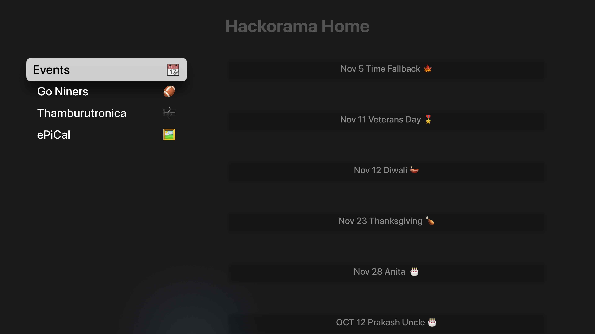
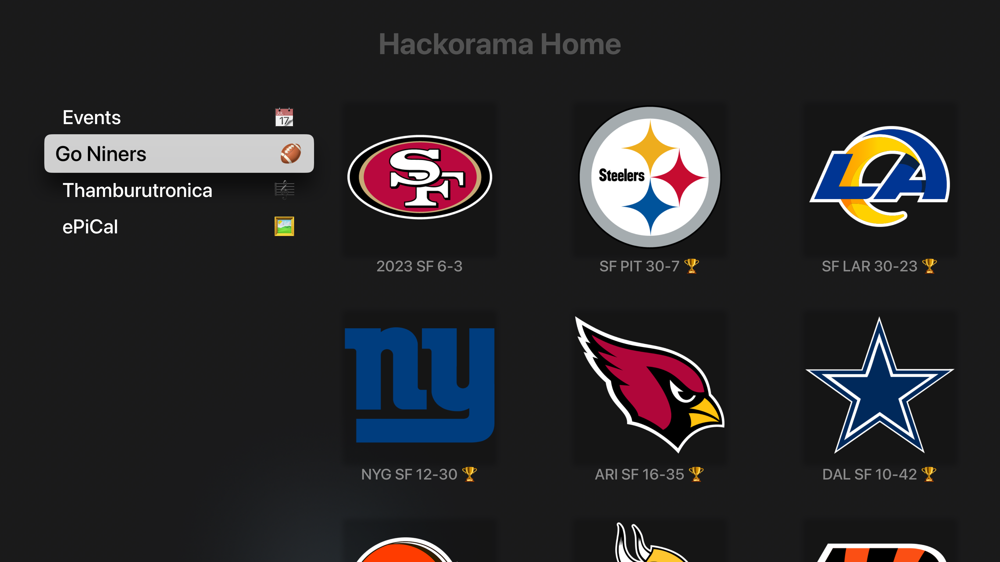
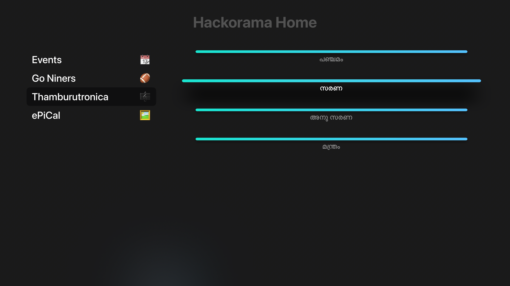
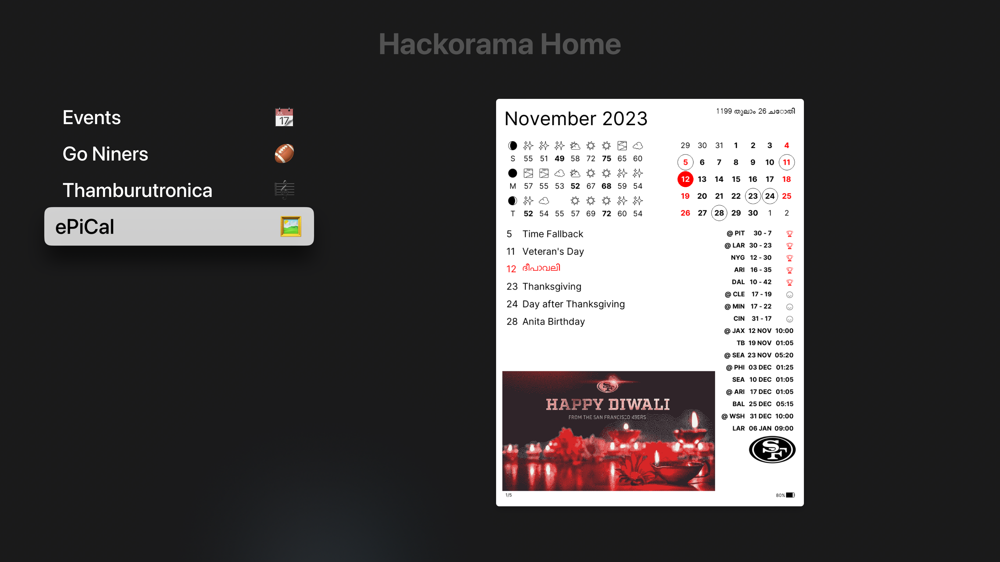

# TVHomeScreen

A simple home screen [tvOS](https://developer.apple.com/tvos/) app for [Apple TV](https://www.apple.com/apple-tv-4k/). Displays calendar events and a dashboard for other home projects:
([Thamburatronica](https://github.com/hackorama/thamburutronica), [ePiCal](https://github.com/hackorama/epical)

Developed using [TVML](https://developer.apple.com/documentation/TVML) for [tvOS](https://developer.apple.com/tvos/) and for local device deploy only, not published to the App Store.

|   |   |
|---|---|
|           |    |
|  |  |

# Development

1. Deploy the TVML and JavaScript resources on a home server ([server.sh](./hackorama/server.sh)) in the same WiFi network as the Apple TV
2. Deploy the tvOS app on AppleTV using XCode

See more details in [dev notes](./docs/dev.md)

