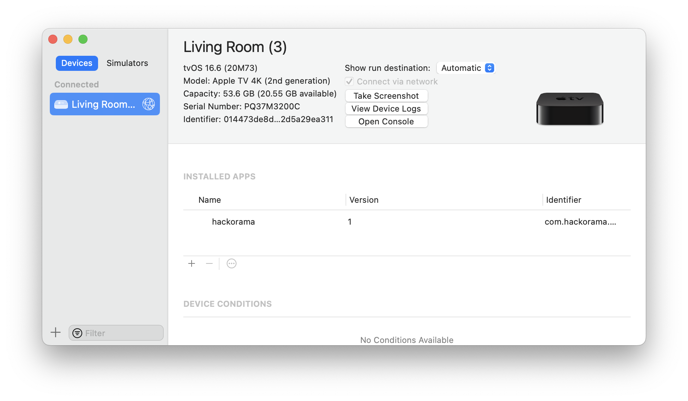
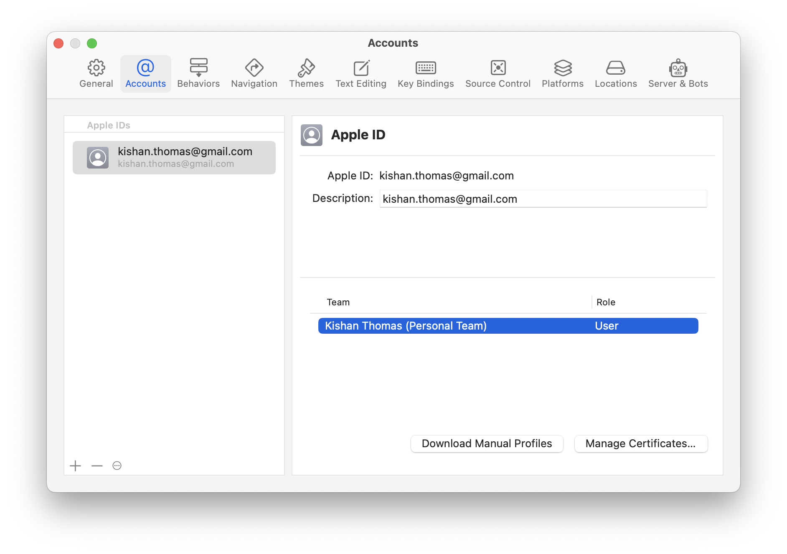
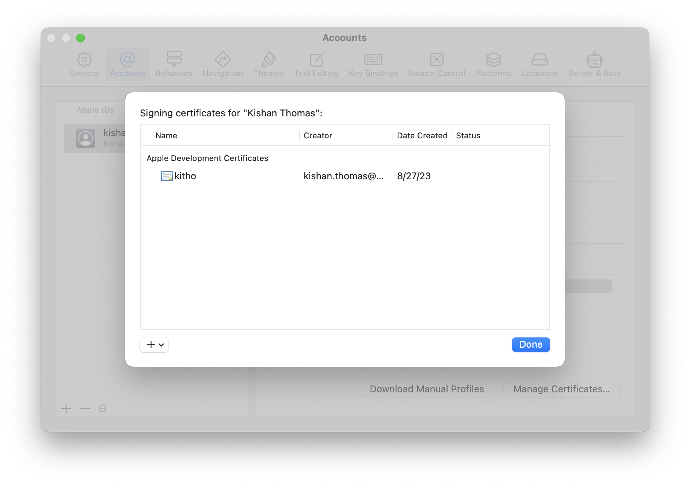
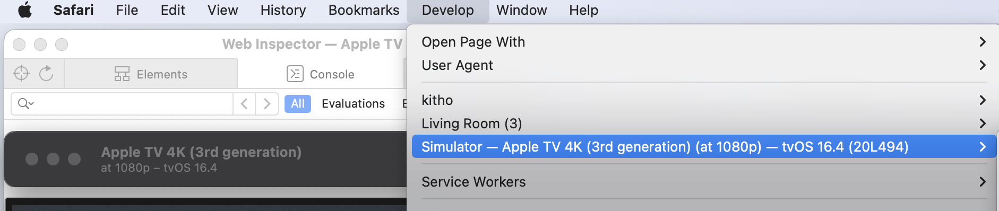

## Device Setup

- Apple TV LAN - Test device
- MacBook Wi-Fi  - Runs Xcode development system
- Mac mini Wi-Fi - Runs the test server for tvml/tvui

- macOS Ventura 13.5.1
- tvOS 16.6
- Xcode 14.13.1

> If you don't have a [developer account](https://developer.apple.com/programs/) your provisioning profile will be valid for only 7 days and so you will need to redeploy every week.

## Run on Simulator

Create new project "hackorama"

File -> New -> Project
tvOS -> TVML App

Start local server on Terminal

```
$ cd Developer/hackorama
$ ls
docs                hackorama           hackorama.xcodeproj hackoramaTests      hackoramaUITests
$ cd hackorama
$ [2023-08-27 15:32:36] INFO  WEBrick 1.4.4
[2023-08-27 15:32:36] INFO  ruby 2.6.8 (2021-07-07) [universal.x86_64-darwin21]
[2023-08-27 15:32:36] INFO  WEBrick::HTTPServer#start: pid=76712 port=9001ruby -run -ehttpd . -p9001
...
```

Now run the project from Xcode

Simulator window will come up with "Hello World!" message

### Simulator remote

Use keyboard arrow keys to navigate between screen elements or use the remote

Simulator: Window -> Show Apple TV Remote (⇧ ⌘ R)

Hold the ⌥ to use remote touch area

## Deploy to AppleTV

### Connect XCode and Apple TV

Setup device

Apple TV: Settings -> Remted and Devices -> Remote app and Devices

Xcode: Window -> Devices and Simulators



Setup account and team

Xcode -> Settings: Accounts

  +: Add apple cloud account, and team

  Manage Certificates...: Add certs for the macBook





## Run the server from Apple Mini

```
$ cd ~/Developer/hackorama
$ tar -cvf hackorama.tar hackorama
$ scp hackorama.tar mini
```

```
$ ssh mini
# tar -xvf hackorama.tar
# cd hackorama
# ruby -run -ehttpd . -p9001
...
[2023-08-27 15:32:36] INFO  WEBrick::HTTPServer#start: pid=76712 port=9001
...
```

## Update server IP in AppDelegate.swift

`static let tvBaseURL = "http://192.168.1.163:9001/"`

Run on Simulator to confirm server IP connection

## Select the Apple TV device

Apple TV: Settings -> Remted and Devices -> Remote app and Devices

Xcode: Poduct -> Destination -> Device -> tvOS Device

Run the project ...

## Set App Icon and Top Shelf splash

The app will run with place holder outline icon.

Delete the app from Apple TV

Update the icon and top shelf image and run again to install with icon.

Assets -> App Icon & Top Shelf Image > App Icon

Add the same 1x and 2x png images for front, middle, back

Assets -> App Icon & Top Shelf Image > Top Shelf Image Wide

Add the 1x and 2x images.

```
$ convert logo.png -resize 400x240  -background grey -gravity center -extent 400x240 apple-tvos-icon-1x.png
$ convert logo.png -resize 800x480  -background grey -gravity center -extent 800x480 apple-tvos-icon-2x.png
```

```
$ convert img.png -resize 2320^x720  -extent 2320x720 topshelf_1x.png
$ convert img.png  -resize 4640^x1440 -extent 4640x1440 topshelf_2x.png
```

## JS Console

For simulator

Xcode: Poduct -> Destination -> Simulator : ...
Safari:  Develop -> Simulator ...



For on device:

Xcode: Poduct -> Destination ->  AppleTV : ...
Safari:  Develop -> AppleTV ...

## Device Console

Check for any app launch errors on the device

Xcode: Window -> Devices and Simulators
Select AppleTV and on right panel: Open Console or Recent Logs


### Launch error

Get the [logs](./launch.error.logs.txt) using device console.

```
A valid provisioning profile for this executable was not found
```

Xcode: Window -> Devices and Simulators: Right click on the device : "Provisioning profiles..."

- Check a valid profile is available if not add a new one with '+"
- If there is a valid profile check it is not expired
  - The XCode dev application profiles expires in 7 days.
  - So will have to redeploy dev applications once every week


# Xcodebuild

## Project details

```
$ cd hackorama
$ xcodebuild -list -project  hackorama.xcodeproj
Command line invocation:
    /Applications/Xcode.app/Contents/Developer/usr/bin/xcodebuild -list -project hackorama.xcodeproj

User defaults from command line:
    IDEPackageSupportUseBuiltinSCM = YES

Information about project "hackorama":
    Targets:
        hackorama
        hackoramaTests
        hackoramaUITests

    Build Configurations:
        Debug
        Release

    If no build configuration is specified and -scheme is not passed then "Release" is used.

    Schemes:
        hackorama
```

### Workspace

```
$ cd hackorama/hackorama.xcodeproj
$ xcodebuild -list -workspace project.xcworkspace
Command line invocation:
    /Applications/Xcode.app/Contents/Developer/usr/bin/xcodebuild -list -workspace project.xcworkspace

User defaults from command line:
    IDEPackageSupportUseBuiltinSCM = YES

Information about workspace "hackorama":
    Schemes:
        hackorama
```

### Build using scheme

```
$ cd hackorama
$ xcodebuild -scheme hackorama build
...
CodeSign /Users/kitho/Library/Developer/Xcode/DerivedData/hackorama-dgsixmsrmgkkmvcflqhrzjnlsudy/Build/Products/Debug-appletvos/hackorama.app (in target 'hackorama' from project 'hackorama')
    cd /Users/kitho/Developer/hackorama

    Signing Identity:     "Apple Development: kishan.thomas@gmail.com (XP358FGR28)"
    Provisioning Profile: "tvOS Team Provisioning Profile: com.hackorama.hackorama"
                          (52c286ec-38bc-4af5-ba5d-2995c2a2ab2f)
...
** BUILD SUCCEEDED **
$
```

```
$ xcodebuild -scheme hackorama -derivedDataPath build
$ xcrun xcodebuild -scheme hackorama -destination 'platform=tvOS Simulator' -derivedDataPath build
```


### Destinations

List destinations by specifying invalid name

```
$ cd hackorama/hackorama.xcodeproj
$ xcodebuild -workspace project.xcworkspace -scheme hackorama -destination 'platform=invalid,name=invalid,OS=1' build
...
--- xcodebuild: WARNING: Using the first of multiple matching destinations:
{ platform:tvOS, id:dvtdevice-DVTiOSDevicePlaceholder-appletvos:placeholder, name:Any tvOS Device }
{ platform:tvOS Simulator, id:dvtdevice-DVTiOSDeviceSimulatorPlaceholder-appletvsimulator:placeholder, name:Any tvOS Simulator Device }
{ platform:tvOS Simulator, id:830F8FC2-90DF-4D55-AFED-B9C3EFDF31AE, OS:16.4, name:Apple TV }
{ platform:tvOS Simulator, id:3B78886A-BCDF-4A7F-9578-935C6922D431, OS:17.0, name:Apple TV }
{ platform:tvOS Simulator, id:0DFBD417-E152-460E-BB16-BF3DAFB4AC66, OS:16.4, name:Apple TV 4K (3rd generation) }
{ platform:tvOS Simulator, id:96FE118D-06AE-4E0D-87F7-65ACCD2A905E, OS:17.0, name:Apple TV 4K (3rd generation) }
{ platform:tvOS Simulator, id:C504C82E-1691-4313-87C6-3CEDBCA81937, OS:16.4, name:Apple TV 4K (3rd generation) (at 1080p) }
{ platform:tvOS Simulator, id:A088CEF2-9924-482F-925D-BE5F904DE7ED, OS:17.0, name:Apple TV 4K (3rd generation) (at 1080p) }
...

```

### Build and launch on Simulator

```
$ xcodebuild -scheme hackorama -destination 'platform=tvOS Simulator,name=Apple TV 4K (3rd generation) (at 1080p)' -derivedDataPath build
$ open -a Simulator
$ xcrun simctl launch booted com.hackorama.hackorama
```

### Build and launch on Device

```
$ xcodebuild -workspace project.xcworkspace -scheme hackorama -destination 'platform=tvOS' build
```
